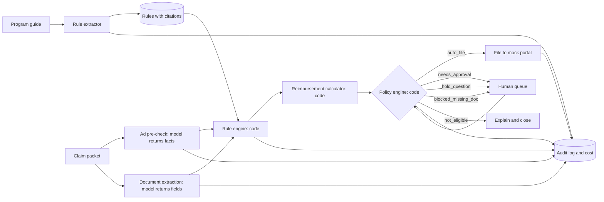

# Co-op claim agent: build spec and SOP

This document is the full brief for prototyping the co-op claim agent. It is written to be handed to a coding agent. Read the whole thing before writing code.

## How to use this document (instructions for the coding agent)

- Build in the milestone order in section 12. Each milestone has a definition of done. Do not start the next milestone until the current one passes its checks.
- Run the tests after every milestone. `tests/test_packets.py` is the source of truth for correct behavior.
- One design rule governs everything: **the model perceives, code decides.** Use the language model to read documents and images and return structured facts. Do all comparisons, date math, amounts, thresholds and final decisions in plain Python, so that every decision is reproducible and testable.
- All data is synthetic. The brand (Northwind Comfort) and dealer (Summit Heating and Air) are made up. Do not add real brand names, real logos, or scrape real portals.
- Keep the model provider behind one wrapper (`agent/llm.py`). Read the model name and token prices from config. Do not hardcode a model name or price from memory. Check the provider's current documentation and put the values in `config.yaml`.
- Ask before adding a dependency that is not listed in section 10.
- If something in this spec is ambiguous, pick the simpler option, leave a `# DECISION:` comment explaining it, and move on.
- License MIT. The repo must be open source.

---

## 1. The problem

**Co-op advertising:** a manufacturer sets aside money for each dealer, usually a percentage of what the dealer buys, and reimburses part of the dealer's local advertising cost if the ad follows the brand's rules and the dealer files a claim with proof.

**Who owns the problem:** the owner or office manager of an independent dealer (HVAC contractor, power equipment dealer, appliance store) that carries several brands. They are not marketers.

**The process today:**

1. Read a guidelines PDF per brand. Guess whether a planned ad qualifies.
2. Run the ad.
3. Collect the media invoice, a copy of the ad, proof of payment, and proof it ran.
4. Key a claim into the manufacturer's or distributor's portal.
5. Wait weeks. Get rejected for a small logo, a missing document, or a missed deadline, or get a partial payment with no explanation.
6. Often, give up. Unused funds expire at year end.

**Size:** industry estimates put unclaimed US co-op funds at $14 to $35 billion a year out of $36 to $70 billion available. The estimates are about a decade old, so treat them as an order of magnitude.

**Metric to improve:** dollars recovered per dealer per year. Supporting metrics: claim rejection rate, hours spent per claim, dollars expiring unused.

**Why an agent fits:** the rules are written down but scattered across PDFs, the evidence arrives as mixed documents and images, the portals have no API, and approvals are human-gated. Each step is within reach of current models. Nobody has wired them together for the dealer.

## 2. What the prototype must prove

Given a manufacturer's co-op guide and a dealer's claim packet, the agent decides what qualifies, explains why with a citation to the guide, computes the reimbursement, files what is clean and small, and stops to ask about anything else, with every step logged and priced.

### In scope

- Rule extraction from a program guide, with citations
- Pre-check of an ad before it runs
- Full claim check: ad, invoice, proof of payment, claim form
- Reimbursement calculation with exclusions and a balance cap
- Policy engine: auto-file, human approval, hold with a question, blocked, not eligible
- Human queue with approve, reject and answer actions
- Audit log and cost per claim
- Funds ledger per dealer and program
- Six synthetic packets and a test harness

### Stretch, in order

1. File an approved claim into a mock manufacturer portal using browser automation
2. Change the portal layout and show the agent stopping instead of guessing
3. Digital claim: a Google Ads style campaign with 50 assets (section 9)
4. Withdraw a filed claim from the audit log

### Out of scope

Real portal logins, real accrual feeds, multi-tenant accounts, authentication, payments.

## 3. Glossary

| Term | Meaning |
|---|---|
| Program | One brand's co-op plan for a year, defined by its guide |
| Accrual | Funds a dealer has earned, usually a percentage of purchases |
| Balance | Accrued minus reimbursed minus approved-but-unpaid |
| Packet | Everything a dealer submits for one claim |
| Proof of performance | Evidence the ad ran: the printed piece, a screenshot, a broadcast affidavit, a platform report |
| Pre-approval | Brand sign-off on creative before it runs |
| Credit memo | Common form of payment: a credit on the dealer's account with the distributor, not cash |
| Pre-check | Agent check of an ad before it runs, ad only |

## 4. Users and flows

**Dealer (primary user)**

1. Opens the home screen. Sees balances per brand, deadlines, and a "needs you" list.
2. Uploads a draft ad for pre-check. Gets pass, fail or unsure per rule, each with the cited rule and the smallest fix.
3. After the ad runs, uploads or forwards the packet. The agent checks it, computes the reimbursement, and either files it, asks for approval, asks a question, or explains why it is not eligible.
4. Approves filings above the threshold. Answers questions.
5. Watches status through to the credit memo.

**Reviewer (secondary, for the demo)**

Sees the human queue, the evidence for each check, and the audit log.

## 5. System design



Components:

| Module | Responsibility | Uses model |
|---|---|---|
| `agent/llm.py` | Single wrapper for model calls. Structured JSON output, token and cost accounting, record and replay | yes |
| `agent/extract_rules.py` | Guide text to rules JSON with citations | yes |
| `agent/precheck.py` | Ad image or script to observed facts: logo boxes, tagline present, brands mentioned, offer phrases | yes |
| `agent/documents.py` | Invoice, payment proof, claim form to fields | yes |
| `agent/rules_engine.py` | Applies rules to observed facts. Returns a verdict per rule | no |
| `agent/reimbursement.py` | Eligible cost, exclusions, rate, cap | no |
| `agent/policy.py` | Turns verdicts and amounts into one decision | no |
| `agent/audit.py` | Writes audit events | no |
| `app.py` | Web UI and endpoints | no |
| `scripts/make_packets.py` | Renders synthetic ads and documents from HTML templates | no |

## 6. Data contracts

Use Pydantic models for all of these. Validate every model response against its schema and retry once on failure.

### 6.1 Rule

```json
{
  "id": "R3-logo-min-size",
  "program_id": "northwind-2026",
  "title": "Brand logo minimum size",
  "kind": "measured",
  "applies_to": ["direct_mail", "newspaper", "paid_social"],
  "check": {
    "type": "logo_size",
    "min_width_in": 1.0,
    "min_ratio_to_dealer_logo": 0.5
  },
  "source": {"section": "3", "quote": "at least 1 inch wide and at least half the width of the dealer's logo"},
  "on_fail": "Enlarge the Northwind logo to at least {required_in} in."
}
```

`kind` is `measured` (code can compute it from observed facts) or `judgment` (the model's reading is needed, and the UI must say so).

Supported `check.type` values for the prototype:

| type | Parameters | Facts needed |
|---|---|---|
| `logo_size` | `min_width_in`, `min_ratio_to_dealer_logo` | brand and dealer logo widths in inches |
| `required_text` | `text` | whether the text appears in the ad or script |
| `eligible_media` | `allowed`, `excluded` | medium from the claim form |
| `no_competing_brands` | none | list of brand names observed in the ad |
| `restricted_offer` | `trigger_words`, `requires_doc` | offer phrases observed, documents present |
| `date_window` | `activity_start`, `activity_end`, `claim_within_days`, `claim_by` | invoice date, submitted date |
| `required_documents` | `docs` | documents present in the packet |
| `amounts_match` | `tolerance_usd` | claim form total, invoice total, payment total |

### 6.2 Packet manifest

Each packet is a folder with a `manifest.json`:

```json
{
  "packet_id": "F",
  "mode": "claim",
  "dealer_id": "summit",
  "program_id": "northwind-2026",
  "medium": "direct_mail",
  "physical_size_in": {"width": 6, "height": 4},
  "submitted_on": "2026-10-20",
  "files": {
    "ad": "ad.png",
    "claim_form": "claim_form.pdf",
    "invoice": "invoice.pdf",
    "payment": "payment.pdf"
  }
}
```

`mode` is `precheck` (ad only) or `claim` (full packet). For radio, `ad` points to `script.txt` and the packet includes `affidavit.pdf`.

### 6.3 Observed facts (model output)

```json
{
  "ad": {
    "brand_logo_bbox_px": [812, 40, 960, 92],
    "dealer_logo_bbox_px": [40, 36, 548, 120],
    "image_size_px": [1200, 800],
    "text_found": ["Fall furnace tune-up, $89", "Free smart thermostat with any new Northwind furnace", "Comfort you can count on"],
    "brands_mentioned": ["Northwind"],
    "offer_phrases": ["Free smart thermostat"]
  },
  "invoice": {"vendor": "PrintPost Mailers", "number": "8841", "date": "2026-10-06", "total": 600.00,
              "line_items": [{"desc": "Printing", "amount": 350.00}, {"desc": "Postage", "amount": 250.00}]},
  "payment": {"date": "2026-10-08", "amount": 600.00, "method": "card"},
  "claim_form": {"medium": "direct_mail", "total_cost": 600.00, "requested": 300.00}
}
```

Logo width in inches is computed in code: `bbox_width_px / image_width_px * physical_width_in`.

### 6.4 Check result

```json
{
  "rule_id": "R3-logo-min-size",
  "verdict": "fail",
  "kind": "measured",
  "evidence": {"brand_logo_in": 0.7, "dealer_logo_in": 2.4, "required_in": 1.2},
  "source": {"section": "3"},
  "message": "Northwind logo is 0.7 in wide. It needs at least 1.2 in.",
  "fix": "Enlarge the Northwind logo to at least 1.2 in.",
  "ask": null
}
```

`verdict` is `pass`, `fail`, `unsure` or `not_applicable`.

**Unsure band:** for `logo_size`, if the measured value is within 10% of the threshold either way, return `unsure`, not pass or fail. Model-estimated boxes are approximate, and this is what stopping to ask looks like for a measured rule.

### 6.5 Claim decision

```json
{
  "claim_id": "0142",
  "packet_id": "F",
  "decision": "hold_question",
  "reasons": ["R5-free-offer: unsure"],
  "reimbursement": {"submitted": 600.0, "excluded": [], "eligible": 600.0, "rate": 0.5,
                    "computed": 300.0, "balance_before": 8050.0, "payable": 300.0},
  "payable_if_resolved": 300.0,
  "questions": [{"id": "q1", "rule_id": "R5-free-offer", "text": "Upload the territory manager's written approval for the free thermostat offer.",
                 "answers": ["upload_document", "no_approval"]}],
  "cost_usd": 0.05
}
```

`decision` values:

| Value | When |
|---|---|
| `auto_file` | Every applicable rule passes, all documents present, payable at or under the threshold |
| `needs_approval` | Same, but payable is over the threshold |
| `hold_question` | Any `unsure`, or an amounts mismatch |
| `blocked_missing_doc` | A required document is missing |
| `fix_needed` | Pre-check mode with at least one `fail` |
| `not_eligible` | Claim mode with a `fail` that cannot be fixed after the fact (dates, medium, creative that already ran) |

Precedence when several apply: `not_eligible`, then `blocked_missing_doc`, then `hold_question`, then `needs_approval`, then `auto_file`.

### 6.6 Audit event

```json
{
  "id": 412, "ts": "2026-10-20T14:02:19Z", "claim_id": "0142",
  "step": "precheck", "actor": "agent",
  "input_ref": "packets/F/ad.png", "output_ref": "facts/0142.json",
  "model": "from-config", "tokens_in": 2310, "tokens_out": 560, "cost_usd": 0.031,
  "note": "6 rules evaluated"
}
```

`actor` is `agent` or `human:<name>`. Every model call, every decision, every human action and every filing writes one event.

### 6.7 Database tables (SQLite)

`programs`, `rules`, `dealers`, `claims`, `documents`, `checks`, `questions`, `ledger_entries`, `audit_events`. Keep JSON blobs in text columns where that is simpler.

## 7. Synthetic data

### 7.1 The program guide

Save as `data/guides/northwind-2026.md` and also render it to PDF. The rule extractor runs on this text.

```
Northwind Comfort: 2026 dealer co-op program

1. Funds. Dealers accrue co-op funds at 2% of Northwind purchases.
   Eligible advertising is reimbursed at 50% of cost, up to the dealer's
   available balance. Agency and management fees are not reimbursed.
2. Media. Eligible: direct mail, newspaper, radio, paid social, paid search.
   Not eligible: directories, sponsorships, apparel, promotional items.
3. Logo. In visual ads the Northwind logo must be at least 1 inch wide and
   at least half the width of the dealer's logo.
4. Tagline. "Comfort you can count on" must appear in the ad or be spoken
   in the script.
5. Offers. Ads offering "free" equipment require written approval from
   your territory manager before they run. Include the approval with your claim.
6. Competing brands. No other heating or cooling brand may appear in the ad.
7. Dates. Advertising must run in calendar 2026. Claims must be submitted
   within 60 days of the vendor invoice date and no later than December 15, 2026.
8. Documents. Each claim needs a copy of the ad or script, the vendor
   invoice, and proof of payment. Radio claims also need a station affidavit.
9. Amounts. The claim form, invoice and proof of payment must agree.
```

Expected extraction: nine rules, ids `R1` to `R9`, each with the section number and a short quote. `R1` carries the rate (0.5), the accrual rate (0.02) and the excluded cost type (agency and management fees).

### 7.2 Dealer and ledger

Dealer `summit`, Summit Heating and Air. Opening state for `northwind-2026`: purchases to date $610,000, accrued $12,200, reimbursed $4,150, balance $8,050.

### 7.3 The six packets

Auto-file threshold: payable at or under $500.

| Packet | Mode | Medium | Planted condition | Key facts | Expected decision | Expected payable |
|---|---|---|---|---|---|---|
| A | claim | direct_mail | none | cost $760, invoice 2026-09-14, submitted 2026-10-01, brand logo 1.3 in, dealer logo 2.4 in | `auto_file` | $380 |
| B | precheck | newspaper | brand logo too small | brand logo 0.7 in, dealer logo 2.4 in | `fix_needed`, R3 fail, fix says 1.2 in | n/a |
| C | claim | radio | filed too late | cost $4,800, invoice 2026-08-03, submitted 2026-10-20 (78 days) | `not_eligible`, R7 fail | $0 |
| D | claim | paid_social | no proof of payment | cost $900, invoice 2026-10-02, submitted 2026-10-15 | `blocked_missing_doc`, R8 | $450 if resolved |
| E | claim | direct_mail | amounts disagree | claim form $1,800, invoice $1,650, payment $1,650 | `hold_question`, R9 | $825 if resolved to invoice, then `needs_approval` |
| F | claim | direct_mail | "free" offer, no approval | cost $600, ad text includes "Free smart thermostat" | `hold_question`, R5 unsure | $300 if resolved |

Each packet folder has an `expected.json` with the expected decision, the expected verdict per rule, and the expected payable. The agent code must never read `expected.json`. Only the tests do.

### 7.4 Generating the files

`scripts/make_packets.py` renders HTML templates to PNG and PDF with Playwright. The ad template takes brand logo width, dealer logo width, headline, offer line and tagline as parameters, so violations are planted exactly. Logos are plain colored boxes with the name in text. Render ads at 200 px per inch so a 6 x 4 in postcard is 1200 x 800 px.

## 8. Logic details

### 8.1 Rule extraction

- Input: guide text (from markdown or PDF text).
- Prompt the model to return a list of rules in the schema from 6.1, using only the `check.type` values listed there, each with the section number and a quote of 25 words or fewer taken from the guide.
- In code, verify that every quote is a substring of the guide after whitespace normalization. Drop or flag any rule whose quote does not match. This keeps citations honest.
- Persist rules. Show them in the UI with a link to the section.

### 8.2 Pre-check

- Send the ad image and ask for the facts in 6.3 only. Do not ask the model for verdicts.
- For radio, send the script text and ask for `text_found`, `brands_mentioned`, `offer_phrases`.
- The rules engine turns facts into verdicts.
- `restricted_offer`: if a trigger word appears in `offer_phrases` and the required document is not in the packet, the verdict is `unsure` with an `ask`. If the document is present, `pass`.

### 8.3 Document extraction

- Extract PDF text first. Send text to the model for field extraction. Fall back to sending the page image if the text layer is empty.
- A missing file is a fact, not an error: record `null` for that document.
- If a field cannot be read with confidence, return `null` for it. Null fields lead to `hold_question`, never to a guess.

### 8.4 Reimbursement

```
submitted   = claim form total
basis       = invoice total, if amounts match within tolerance, else unresolved
excluded    = sum of line items whose description matches an excluded cost type
eligible    = basis - excluded
computed    = eligible * rate
payable     = min(computed, balance_before)
```

If the verdict set contains a non-fixable `fail`, payable is 0. If amounts are unresolved, `payable_if_resolved` uses the invoice total.

### 8.5 Policy

Implement the table and precedence in 6.5 as a pure function: `decide(mode, checks, reimbursement, threshold) -> Decision`. Unit test it without any model calls.

### 8.6 Answering questions

`POST /claims/{id}/answer` records the human's answer as an audit event, updates the facts (for example, attaches the uploaded document or sets the resolved amount), and re-runs the rules engine and policy. It does not re-run model calls unless a new document was added.

### 8.7 Filing

For the core build, filing means setting the claim status to `filed`, writing a pending ledger entry, and writing an audit event. The stretch goal replaces this with a Playwright run against the mock portal.

### 8.8 Guardrails

- Never create, edit or enhance a proof document. The agent reads evidence. It does not produce it.
- Never file without: every required document present, amounts agreed, and either an auto-file decision or a recorded human approval.
- Always show the cited rule next to a verdict.
- Say `unsure` when unsure. A wrong pass costs the dealer a rejected claim. A wrong fail costs them money they were owed.

## 9. Stretch: digital claim with 50 assets

A packet `G` with `mode: claim`, `medium: paid_search`, containing `assets.csv` (50 rows: asset id, type, text or image file, campaign, landing page URL), `campaign_report.csv` (campaign, dates, impressions, clicks, cost, in-territory share), `billing.pdf` and `agency_invoice.pdf`.

Additional checks:

| Check | Logic |
|---|---|
| Brand present in every combination | Every headline pool must have a pinned headline containing the brand name, or every headline must contain it |
| Competing brands | Any asset naming another HVAC brand fails |
| Landing page | Page must feature only the program's brand. For the prototype, use local HTML files |
| Eligible spend | Only campaigns where every asset passes and the landing page passes are claimable. Multiply by in-territory share |
| Agency fee | Excluded under R1 |

Output: asset table with verdicts, a list of claimable and non-claimable campaigns, the reimbursement calculation, and a restructuring suggestion with the dollar difference.

## 10. Stack and repo

| Piece | Choice |
|---|---|
| Language | Python 3.11+ |
| Web | FastAPI, Jinja2 templates, a little vanilla JS. No front-end build step |
| Storage | SQLite through the standard library or SQLModel |
| Schemas | Pydantic v2 |
| PDF text | PyMuPDF |
| Rendering synthetic files, and the stretch portal | Playwright with Chromium |
| Model | One multimodal model with structured output, behind `agent/llm.py`. Name and prices in `config.yaml` |
| Tests | pytest |

```
coop-claim-agent/
  README.md
  LICENSE
  SPEC.md                 this file
  config.yaml             model name, token prices, auto-file threshold, unsure band
  Makefile                setup, data, test, demo
  app.py
  agent/
    llm.py
    extract_rules.py
    precheck.py
    documents.py
    rules_engine.py
    reimbursement.py
    policy.py
    audit.py
    models.py             Pydantic schemas
  data/
    guides/northwind-2026.md
    packets/A..F/         manifest.json, files, expected.json
    recordings/           saved model responses for replay mode
  templates/
    synthetic/            ad.html, invoice.html, payment.html, claim_form.html, affidavit.html
    ui/                   home.html, claim.html, queue.html, audit.html, funds.html, program.html
  scripts/
    make_packets.py
    seed_db.py
  portal/                 stretch: mock manufacturer portal
  tests/
    test_rules_engine.py
    test_policy.py
    test_reimbursement.py
    test_packets.py
```

### Model wrapper and replay

`agent/llm.py` exposes `call(task: str, schema: type[BaseModel], text: str | None, images: list[bytes] | None) -> (BaseModel, Usage)`.

`LLM_MODE` environment variable:

| Value | Behavior |
|---|---|
| `live` | Calls the provider |
| `record` | Calls the provider and saves each response under `data/recordings/`, keyed by a hash of task and inputs |
| `replay` | Serves saved responses. No network. Used by tests and as the demo fallback |

Cost is `tokens_in * price_in + tokens_out * price_out`, with prices from `config.yaml`. In replay mode, report the recorded usage.

### Commands

```
make setup     install dependencies and Playwright's browser
make data      render the six packets and seed the database
make test      run pytest in replay mode
make demo      start the app on localhost:8000
```

Environment: `LLM_API_KEY`, `LLM_MODE`, `DATABASE_URL` (default `sqlite:///coop.db`).

## 11. Screens

Plain, legible, one column on mobile. Wireframes show content, not styling.

**Home**

```
+------------------------------------------------------------------+
|  Summit Heating and Air                   Recovered 2026  $4,150 |
+------------------------------------------------------------------+
|  Program            Balance   Rate  Next deadline    Expiring    |
|  Northwind 2026     $8,050    50%   Claim by Dec 15  $8,050      |
+------------------------------------------------------------------+
|  Needs you (3)                                                   |
|  D  Upload proof of payment                          [Open]      |
|  E  Claim form says $1,800, invoice says $1,650      [Open]      |
|  F  "Free" offer needs written approval              [Open]      |
+------------------------------------------------------------------+
|  Claims        Medium        Payable   Decision        Cost      |
|  A             direct mail   $380      Filed           $0.04     |
|  B (pre-check) newspaper     n/a       Fix needed      $0.03     |
|  C             radio         $0        Not eligible    $0.04     |
|  [Run all packets]                        Total cost   $0.24     |
+------------------------------------------------------------------+
```

**Claim detail:** ad preview with the measured logo boxes drawn on it, the list of checks (fails and unsure first, each with message, cited section and fix or question), the reimbursement calculation as a line-by-line breakdown, action buttons (approve, reject, answer), and the claim's audit events.

**Queue:** everything with `needs_approval`, `hold_question` or `blocked_missing_doc`.

**Program:** upload a guide, see extracted rules with section and quote, flag any rule whose quote failed verification.

**Funds:** metrics (accrued, reimbursed, approved not yet paid, expiring) and the ledger.

**Audit:** filterable table of audit events with running cost.

## 12. Build order

| Milestone | Build | Done when |
|---|---|---|
| M0 | Repo skeleton, config, Pydantic models, SQLite tables, Makefile | `make setup` works, models import, empty app starts |
| M1 | Synthetic templates and `make_packets.py` | `make data` renders all six packets and `expected.json` files exist |
| M2 | `rules_engine.py`, `reimbursement.py`, `policy.py` with unit tests on hand-written facts | `test_rules_engine`, `test_reimbursement`, `test_policy` pass with no model calls |
| M3 | `llm.py` with record and replay, `extract_rules.py` with quote verification | Nine rules extracted from the Northwind guide, all quotes verified, recording saved |
| M4 | `precheck.py` and `documents.py`, end-to-end pipeline, audit events | `test_packets.py` passes for all six packets in replay mode |
| M5 | UI: home, claim detail, queue with approve, reject, answer. Funds and audit pages. Cost meter | A person can click through all six packets, resolve D, E and F, and see the ledger and log update |
| M6 | README with the problem paragraph, what is mocked, how to run. Demo rehearsal in replay mode | Fresh clone to running demo in under five minutes |
| S1 to S4 | Stretch goals from section 2 | Each has its own test |

If time is short, cut in this order: stretch goals, the program upload screen (use pre-extracted rules), packet C. Never cut packets D, E and F, the audit log, or the cost meter.

## 13. Tests and evaluation

- `test_packets.py` runs the pipeline on each packet and compares to `expected.json`: decision, verdict per rule, payable within one cent.
- Logo measurements pass if within 0.15 in of ground truth.
- Report per run: decisions correct out of six, rule verdicts correct, total cost, cost per claim, count of claims that stopped to ask.
- Later, grow this into the 100-packet benchmark: five guides, twenty packets each, half with planted violations. Score violations caught, false alarms, correct use of unsure, cost per claim.

## 14. Deployment

### 14.1 Running the prototype

- Local: `make setup && make data && make demo`.
- Hosted demo: one container. Include a `Dockerfile` that installs dependencies and Playwright's browser, runs `make data` at build time, and starts the app with `LLM_MODE=replay` by default so the demo works without a key. Any container host works. SQLite on the container's disk is fine for a demo.
- Secrets only through environment variables. Nothing sensitive in the repo. All data is synthetic.

### 14.2 Deploying at a real customer

Roll out in phases. Each phase has an exit test.

| Phase | What the agent may do | Exit test |
|---|---|---|
| 0. Shadow | Reads past claims and their outcomes. Files nothing | Agrees with the real outcome on at least 90% of past claims, and every disagreement is explained |
| 1. Pre-check only | Checks draft ads. No access to portals | Dealers act on the fixes. Rejections for creative reasons drop |
| 2. Assisted filing | Assembles claims. A person approves every filing | Zero rejections for missing or mismatched documents over 50 claims |
| 3. Supervised auto-file | Files clean claims under the threshold. Everything else queues | Rejection rate on auto-filed claims under 2% |
| 4. Scale | More programs, more dealers, higher threshold per claim type with clean history | Reviewed quarterly |

Controls a buyer will ask about:

| Concern | Approach |
|---|---|
| Identity | The agent uses its own delegated login per portal where the portal supports it. Credentials live in a secrets manager, never in the database |
| Permissions | Read-only by default. Filing permission granted per program, per dealer |
| Approvals | Dollar threshold per claim type. Any `unsure`, mismatch or new program always goes to a person |
| Audit trail | Every model call, decision, human action and filing, with inputs and outputs by reference |
| Cost per task | Logged per step, shown per claim, with a monthly budget and a hard stop |
| Cost of failure | Wrong pass: a rejected claim, usually fixable. Wrong fail: money left unclaimed, caught by sampling. False claim: the serious one, prevented by never generating evidence and never filing without matched documents |
| Data | Packets contain business invoices and payment receipts. Encrypt at rest, restrict by dealer, set a retention period, mask card numbers on ingestion |
| Change detection | If a portal page does not match the expected structure, stop and queue a task. Never retry blindly |

### 14.3 Operating procedure for one claim

1. **Intake.** Packet arrives by upload or forwarded email. Create the claim, store documents, write an audit event.
2. **Identify the program.** Match brand and year. If the program's rules are not loaded or changed since last extraction, extract and have a person review the rules once.
3. **Extract facts.** Ad, invoice, payment, claim form. Nulls are allowed.
4. **Apply rules.** Verdict per rule with citation.
5. **Compute reimbursement.** Exclusions, rate, balance cap.
6. **Decide.** Policy table in 6.5.
7. **Resolve.** Dealer answers questions, uploads documents, approves. Re-run steps 4 to 6.
8. **File.** Submit, record confirmation, add a pending ledger entry.
9. **Follow up.** Check status on a schedule. Answer reviewer questions with documents already on file. Escalate to the dealer if a new document is needed.
10. **Close.** Confirm the credit memo or payment appears. Update the ledger. If the paid amount differs from the approved amount, open a task.

Weekly: sample five auto-filed claims and five `not_eligible` decisions for human review. Track rejection rate, dollars recovered, dollars expiring, cost per claim, and share of claims that needed a person.

## 15. Demo script, three minutes

| Time | Show |
|---|---|
| 0:00 | The problem and its owner: an HVAC contractor's office manager, money expiring unused |
| 0:20 | Program page. Drop in the guide. Nine rules appear, each with its section and quote |
| 0:50 | Home. Run all packets. A files itself. Open B: failed logo rule, measured boxes on the ad, the fix, the citation |
| 1:30 | Open E: amounts disagree, the agent asks which is right. Answer. It recomputes to $825 and moves to the approval queue because it is over $500. Approve |
| 2:10 | Funds ledger updates. Audit log. Six claims, total model cost, cost per claim, against about twenty minutes each by hand |
| 2:40 | Next: real portals, the 50-asset digital claim, distributors as the channel, recovery-fee pricing |

Run the demo in replay mode unless the network is known to be good.
